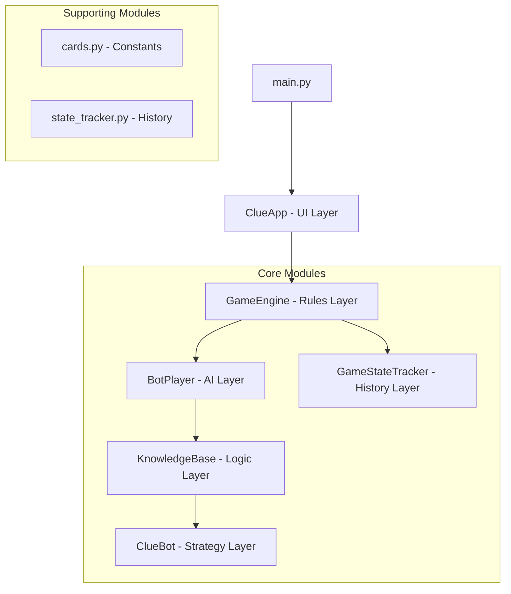

# Clue2 Architecture Specification

## Overview

Clue2 implements the classic Clue board game with a constraint-based AI engine, deterministic bot policies, and a Tkinter UI. The architecture separates concerns into distinct modules: game rules, AI reasoning, knowledge management, and user interface.

## System Architecture

### High-Level Components



#### 1. Game Engine (`game.py`)
- **Classes**: `GameEngine`, `Player`
- **Functions**: Card dealing, solution generation, turn management, suggestion/accusation processing, event logging, bot coordination

#### 2. Knowledge Base (`knowledge_base.py`)
- **Classes**: `KnowledgeBase`, `ContradictionError`
- **Functions**: Boolean constraint matrix with logical propagation, iterative constraint propagation to fixed point, disjunctive constraints for unknown card shows

#### 3. Bot AI (`bot.py`)
- **Classes**: `BotPlayer`, `ClueBot`
- **Functions**: One-step lookahead evaluation, constraint reduction scoring, minimax reasoning, information pressure prioritization, repeat penalties, escape rules

#### 4. User Interface (`app.py`)
- **Classes**: `ClueApp`, `ScrollableFrame`
- **Components**: Board canvas, detective notebook, case ledger, action panel, detective log with Luxury Noir theme

#### 5. Game Constants (`cards.py`)
- **Contents**: Card lists, room adjacency graph, secret passages, UI display constants

#### 6. State Tracking (`state_tracker.py`)
- **Classes**: `GameStateTracker`
- **Functions**: Append-only event history for bot move evaluation, game simulation, deterministic behavior enforcement

## Data Flow

### Initialization Sequence
1. `GameEngine.__init__()` generates solution and deals cards
2. `BotPlayer` instances created with dealt cards
3. `KnowledgeBase.propagate()` reaches logical closure
4. `GameStateTracker` initialized with player names

### Turn Processing
1. `GameEngine` triggers bot turn
2. `BotPlayer` evaluates accusation vs suggestion
3. `ClueBot` simulates all possible outcomes
4. `KnowledgeBase` updates with new constraints
5. Propagation continues to logical closure

## Constraint System

### Propositional Logic
- **Variables**: `has_card(entity, card)` for each player/card pair
- **Domains**: `{True, False, None}` (has card, doesn't have card, unknown)
- **Constraints**: Logical rules governing valid assignments

### Core Constraints
1. **Card Uniqueness**: Each card owned by exactly one entity
2. **Player Hand Limits**: Players have exactly their dealt card count
3. **Envelope Category Rules**: Envelope has exactly one card per category
4. **At-Least-One Clauses**: From observed card shows

### Inference Rules
1. **Card Uniqueness**: Eliminate other owners when card assigned
2. **Singleton Assignment**: Assign card when only one possible owner
3. **Player Card Limits**: Fill/empty slots based on hand size
4. **Clause Reduction**: Remove impossible cards from disjunctive clauses
5. **Envelope Category**: Enforce exactly-one-per-category constraint

## AI Decision Architecture

### Move Evaluation

```python
score = raw_score + info_pressure - repeat_penalty
```

- `raw_score`: Worst-case constraint reduction across possible responses
- `info_pressure`: Bonus for high-uncertainty cards
- `repeat_penalty`: Penalty for recent suggestions

### One-Step Lookahead
1. Enumerate all possible response scenarios
2. Clone knowledge base for each branch
3. Apply hypothetical constraints
4. Score knowledge improvement
5. Select move with best worst-case outcome

### Information Pressure
Targets cards with:
- Many possible owners
- Envelope consideration
- Existing knowledge clause involvement

### Escape Mechanisms
- Progress tracking with 3-turn streak monitoring
- Forced exploration excluding recent suggestions

## User Interface Architecture

### Component Hierarchy
```
ClueApp (Tk root)
├── Top Bar (turn info, controls)
└── Main Container
    ├── Left Panel
    │   ├── Board Canvas (room visualization)
    │   ├── Player Panel (cards, reveals)
    │   └── Action Panel (move controls)
    └── Right Panel
        ├── Detective Log (event history)
        └── Notebook Panel (knowledge grid)
```

### Event Handling
- **Game Events**: `GameEngine` emits structured events
- **UI Updates**: `ClueApp` subscribes and updates displays
- **User Actions**: UI widgets forward actions to `GameEngine`
- **Async Bot Turns**: Uses `after()` for non-blocking execution

### State Synchronization
- **Board State**: Player positions and room highlighting
- **Knowledge State**: Detective notebook with user marks
- **Game State**: Turn indicators and action availability
- **Log State**: Colored event history with filtering

## Performance Optimization

### Knowledge Base
- Lazy propagation when new constraints added
- Incremental updates avoiding unnecessary recomputation
- Early termination when no changes occur
- Sparse representations for unknown assignments

### Bot Performance
- Move caching to avoid re-evaluating identical positions
- Outcome pruning eliminating contradictory simulation branches
- Deterministic behavior with fixed tie-breaking

### UI Responsiveness
- Async bot turns with delays
- Incremental updates redrawing only changed components
- Scroll optimization for large notebooks

## Extensibility

### Modular Design
- Pluggable AI strategies via `ClueBot` replacement
- Configurable UI themes and styling
- Modifiable card sets and rules for game variants
- Different evaluation functions for bot personalities

### Configuration Points
- Card definitions (suspects, weapons, rooms)
- Board layout (room adjacency, secret passages)
- AI parameters (evaluation weights, timeouts)
- UI settings (colors, fonts, layout)

## Testing Architecture

```
tests/
├── test_game.py (GameEngine rules)
├── test_bot.py (BotPlayer behavior)
├── test_knowledge_base.py (Constraint propagation)
└── test_simulation.py (End-to-end scenarios)
```

### Test Strategy
- Unit tests for individual module functionality
- Integration tests for component interactions
- Simulation tests for full game scenarios
- Property tests for invariant verification
