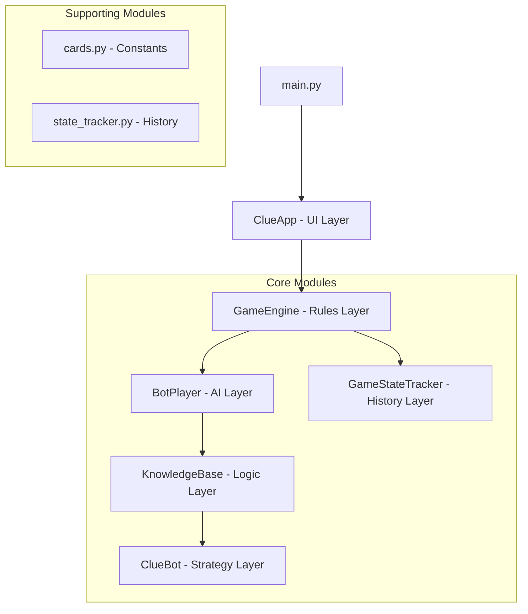
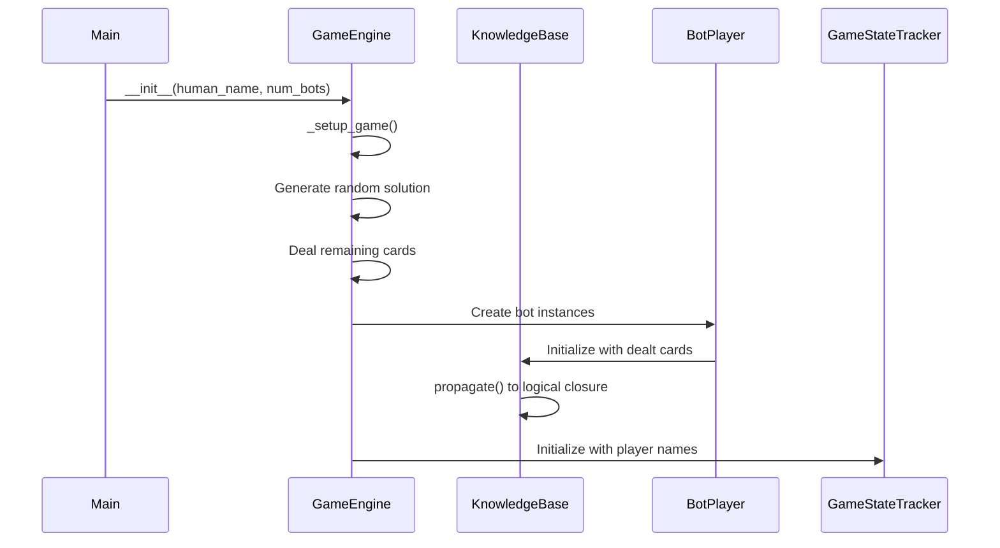
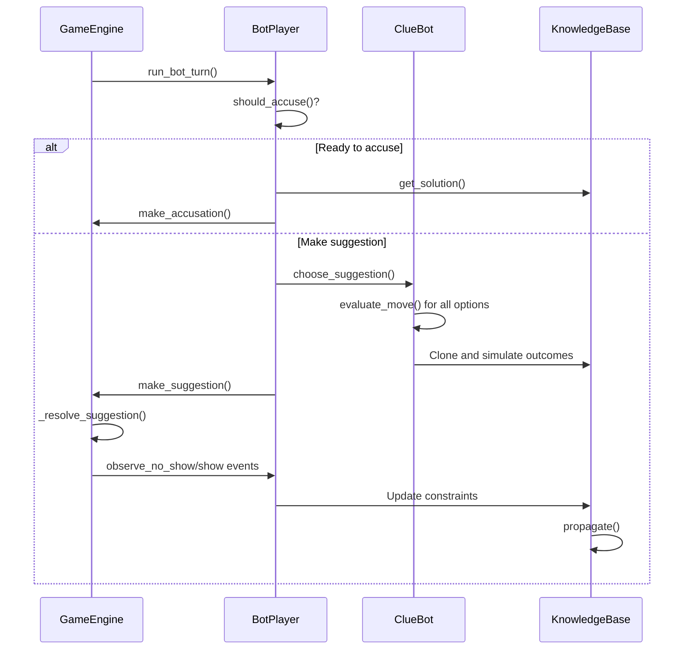
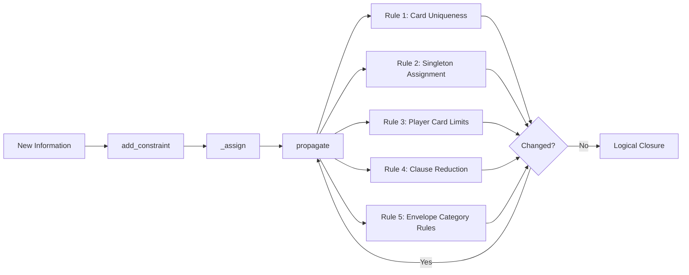

# Clue2 Architecture Specification

## Overview

Clue2 is a sophisticated implementation of the classic Clue board game featuring a constraint-based AI engine, deterministic bot policies, and a themed Tkinter UI. The architecture separates concerns into distinct modules: game rules, AI reasoning, knowledge management, and user interface.

## System Architecture

### High-Level Components



### Module Responsibilities

#### 1. Game Engine (`game.py`)
- **Purpose**: Central rules enforcement and game state management
- **Key Classes**:
  - `GameEngine`: Main orchestrator for game flow
  - `Player`: Human player model
- **Responsibilities**:
  - Card dealing and solution generation
  - Turn management and progression
  - Suggestion and accusation processing
  - Event logging for UI consumption
  - Bot coordination and turn automation

#### 2. Knowledge Base (`knowledge_base.py`)
- **Purpose**: Constraint satisfaction problem (CSP) solver for logical deduction
- **Key Classes**:
  - `KnowledgeBase`: Boolean constraint matrix with logical propagation
  - `ContradictionError`: Exception for constraint violations
- **Core Concepts**:
  - **Boolean Matrix**: `(entity, card) -> True/False/None` assignments
  - **Logical Closure**: Iterative constraint propagation to fixed point
  - **At-Least-One Clauses**: Disjunctive constraints for unknown card shows
  - **Envelope Entity**: Special entity representing murder solution

#### 3. Bot AI (`bot.py`)
- **Purpose**: Deterministic AI with one-step lookahead evaluation
- **Key Classes**:
  - `BotPlayer`: In-game bot wrapper
  - `ClueBot`: Move evaluation and selection policy
- **AI Strategy**:
  - **Constraint Reduction Scoring**: Evaluates moves by information gain
  - **Minimax Reasoning**: Assumes worst-case opponent responses
  - **Information Pressure**: Prioritizes high-uncertainty cards
  - **Repeat Penalties**: Avoids suggestion loops
  - **Escape Rules**: Forces exploration when stuck

#### 4. User Interface (`app.py`)
- **Purpose**: Luxury Noir themed Tkinter interface
- **Key Classes**:
  - `ClueApp`: Main application window
  - `ScrollableFrame`: Custom scrolling container
- **UI Components**:
  - **Board Canvas**: Interactive room visualization
  - **Detective Notebook**: Knowledge tracking grid
  - **Case Ledger**: Card display and reveals
  - **Action Panel**: Move controls and feedback
  - **Detective Log**: Event history with color coding

#### 5. Game Constants (`cards.py`)
- **Purpose**: Centralized game definitions
- **Contents**:
  - Card lists (suspects, weapons, rooms)
  - Room adjacency graph for movement
  - Secret passage connections
  - UI display constants (colors, icons)

#### 6. State Tracking (`state_tracker.py`)
- **Purpose**: Append-only event history for analysis
- **Key Classes**:
  - `GameStateTracker`: Immutable event log
- **Usage**:
  - Bot move evaluation
  - Game simulation
  - Deterministic behavior enforcement

## Data Flow Architecture

### Game Initialization Flow


### Turn Processing Flow


### Knowledge Propagation Flow


## Constraint System Design

### Propositional Logic Foundation

The knowledge base implements a propositional logic system where:
- **Variables**: `has_card(entity, card)` for each player/card pair
- **Domains**: `{True, False, None}` (has card, doesn't have card, unknown)
- **Constraints**: Logical rules governing valid assignments

### Core Constraints

1. **Card Uniqueness**: Each card can be owned by exactly one entity
   ```
   For each card c: sum(has_card(e, c) for e in entities) = 1
   ```

2. **Player Hand Limits**: Players have exactly their dealt card count
   ```
   For each player p: sum(has_card(p, c) for c in cards) = hand_size[p]
   ```

3. **Envelope Category Rules**: Envelope has exactly one card per category
   ```
   For each category: sum(has_card(ENVELOPE, c) for c in category_cards) = 1
   ```

4. **At-Least-One Clauses**: From observed card shows
   ```
   has_card(player, card1) OR has_card(player, card2) OR has_card(player, card3)
   ```

### Inference Rules

The system applies five core inference rules iteratively:

1. **Card Uniqueness Rule**: If a card's owner is confirmed, eliminate all other owners
2. **Singleton Assignment Rule**: If only one possible owner remains, assign the card
3. **Player Card Limits Rule**: Fill remaining slots when hand size is reached
4. **Clause Reduction Rule**: Remove impossible cards from disjunctive clauses
5. **Envelope Category Rule**: Enforce exactly-one-per-category constraint

## AI Decision Architecture

### Move Evaluation Framework

The bot uses a sophisticated evaluation function combining multiple factors:

```python
score = raw_score + info_pressure - repeat_penalty
```

Where:
- `raw_score`: Worst-case constraint reduction across all possible responses
- `info_pressure`: Bonus for targeting high-uncertainty cards
- `repeat_penalty`: Penalty for recent suggestions to avoid loops

### One-Step Lookahead Algorithm

For each legal suggestion:
1. **Enumerate Outcomes**: Simulate all possible response scenarios
2. **Clone Knowledge Base**: Create independent knowledge state for each branch
3. **Apply Constraints**: Update each branch with hypothetical information
4. **Score Reduction**: Calculate knowledge improvement in each branch
5. **Minimax Selection**: Choose move with best worst-case outcome

### Information Pressure Calculation

Prioritizes moves that target:
- Cards with many possible owners (high information value)
- Cards still in envelope consideration
- Cards involved in existing knowledge clauses

### Escape Mechanisms

When bots get stuck in local optima:
- **Progress Tracking**: Monitor knowledge gain streaks
- **Escape Trigger**: After 3 turns without progress
- **Forced Exploration**: Exclude recently tried suggestions

## User Interface Architecture

### Component Hierarchy

```
ClueApp (Tk root)
|
+-- Top Bar (turn info, controls)
|
+-- Main Container
    |
    +-- Left Panel (game area)
    |   |
    |   +-- Board Canvas (room visualization)
    |   +-- Player Panel (cards, reveals)
    |   +-- Action Panel (move controls)
    |
    +-- Right Panel (information)
        |
        +-- Detective Log (event history)
        +-- Notebook Panel (knowledge grid)
```

### Event Handling Architecture

The UI uses an event-driven architecture:
- **Game Events**: `GameEngine` emits structured events
- **UI Updates**: `ClueApp` subscribes and updates displays
- **User Actions**: UI widgets forward actions to `GameEngine`
- **Async Bot Turns**: Uses `after()` for non-blocking bot execution

### State Synchronization

The UI maintains multiple synchronized views:
- **Board State**: Player positions and room highlighting
- **Knowledge State**: Detective notebook with user marks
- **Game State**: Turn indicators and action availability
- **Log State**: Colored event history with filtering

## Performance Considerations

### Knowledge Base Optimization

- **Lazy Propagation**: Only propagates when new constraints are added
- **Incremental Updates**: Tracks changes to avoid unnecessary recomputation
- **Early Termination**: Stops propagation when no changes occur
- **Memory Efficiency**: Uses sparse representations for unknown assignments

### Bot Performance

- **Move Caching**: Avoids re-evaluating identical positions
- **Outcome Pruning**: Eliminates contradictory simulation branches
- **Deterministic Behavior**: Fixed tie-breaking for reproducible results

### UI Responsiveness

- **Async Bot Turns**: Non-blocking bot execution with delays
- **Incremental Updates**: Only redraw changed components
- **Scroll Optimization**: Virtual scrolling for large notebooks

## Extensibility Design

### Modular Architecture

The system is designed for easy extension:
- **Pluggable AI**: `ClueBot` can be replaced with different strategies
- **UI Themes**: Color schemes and styling are configurable
- **Game Variants**: Card sets and rules can be modified
- **Bot Personalities**: Different evaluation functions and behaviors

### Configuration Points

- **Card Definitions**: Easy to add/remove suspects, weapons, rooms
- **Board Layout**: Room adjacency and secret passages configurable
- **AI Parameters**: Evaluation weights and timeouts adjustable
- **UI Settings**: Colors, fonts, and layout customizable

## Testing Architecture

### Test Organization

```
tests/
|
+-- test_game.py (GameEngine rules)
+-- test_bot.py (BotPlayer behavior)
+-- test_knowledge_base.py (Constraint propagation)
+-- test_simulation.py (End-to-end scenarios)
```

### Test Strategy

- **Unit Tests**: Individual module functionality
- **Integration Tests**: Component interactions
- **Simulation Tests**: Full game scenarios
- **Property Tests**: Invariant verification

This architecture provides a solid foundation for a sophisticated Clue implementation with clean separation of concerns, efficient AI reasoning, and an intuitive user interface.
